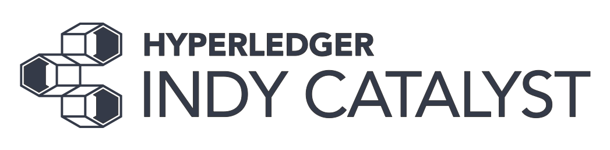

# Hyperledger Indy Catalyst <!-- omit in toc -->



# Table of Contents <!-- omit in toc -->

- [Introduction](#introduction)
- [Decentralized Identity / Self-Soverign Identity](#decentralized-identity--self-soverign-identity)
  - [Emerging Open Standards](#emerging-open-standards)
    - [Decentralized Identifiers (DID)](#decentralized-identifiers-did)
    - [Verifiable Credentials](#verifiable-credentials)
    - [Links to Emerging DID and Verifable Credentials Standards](#links-to-emerging-did-and-verifable-credentials-standards)
  - [Emerging Technology](#emerging-technology)
    - [Distributed Ledger Technology](#distributed-ledger-technology)
    - [Decentralized Key Management Systems](#decentralized-key-management-systems)
    - [Zero Knowledge Proofs](#zero-knowledge-proofs)
  - [General Model of Verifiable Credential based networks](#general-model-of-verifiable-credential-based-networks)
- [Hyperledger Indy](#hyperledger-indy)
  - [Overview](#overview)
  - [Technical information for Hyperledger Indy](#technical-information-for-hyperledger-indy)
- [Hyperledger Indy Catalyst](#hyperledger-indy-catalyst)
  - [Motivation](#motivation)
  - [Who is Indy Catalyst For](#who-is-indy-catalyst-for)
  - [Key Technical Elements](#key-technical-elements)
- [Endnotes](#endnotes)


# Introduction

**Hyperledger Indy Catalyst** is a set of application level software components designed to accelerate the adoption of trustworthy entity to entity[^1] communications. Indy Catalyst is builds upon globally available open standards and open source software. At present, Indy Catalyst builds upon [Hyperledger Indy](https://www.hyperledger.org/projects) and common enterprise open source software such as PostgreSQL, Python, and RESTful principles. Efforts will be taken to design the software to facilitate the incorporation of evolving open standards and technology.

In order to understand the goals and context of Hyperledger Indy Catalyst, it is advisable to become familiar with the general model of trustworthy entity to entity communications. This model is most commonly described using the terms decentralized identity or self-soverign identity. The key standards and technologies enabling this new this model are presented below and annotated with references.

# Decentralized Identity / Self-Soverign Identity

Self-Sovereign Identity is a term coined by [Christoper Allen in 2016](http://www.lifewithalacrity.com/2016/04/the-path-to-self-soverereign-identity.html) to describe a new phase in digital identity. One which "requires that users be the rulers of their own identity." The intent behind the concept of "self-sovereign" is one of control over the data associated to oneself. It is intended to suggest that one can and should have full control over the holding and disclosing of one's personally identifiable data as issued by themselves or issued to them by others. Others may include authoritative issuers such as governments or a local sports club membership. It is not intended to suggest a "digital self-declaration" of ones identity in opposition to officially issued identity attributes. The details of how this can be technically achieved are describe briefly in the following sections along with appropriate references for further study.

It is important to note that while these emerging standards and technologies are being designed to tackle the very difficult challenges of secure and privacy respecting digital identity for people, they are not limited to the narrow context of personal identity. This new model can be applied to a broader set of use cases beyond those involving personally identifiable information. The model offers a generalized capability enabling highly secure entity to entity communications.

## Emerging Open Standards

There are two emerging open standards aimed at enabling interoperable secure and privacy respecting entity to entity data exchange.

### Decentralized Identifiers (DID)

A DID is a globally unique and resolvable indentifier created by a entity. A entity could be any sort of real world actor such as an individual person, a legal entity, a government authority, a thing. DIDs are created and issued by software under the control of a entity. DIDs are bound with the necessary information to allow a entity to demonstrate cryptographic control over the DID and to enable secure communications with that entity.  With these basic primitives, secure and privacy respecting entity to entity data exchange becomes possible. DIDs are under the control of the creating entity and do not require any centralized issuing or resolution authority.

### Verifiable Credentials

A verifiable credential is data issued to, and held by an entity. Verifable indicates the credential is rendered tamper-evident and in a manner whereby the issuer can be cryptographically verified.[^2] Data contained in a verifiable credential is organized into individual claims. Claims within a credential can be about different subjects (e.g entities).

### Links to Emerging DID and Verifable Credentials Standards

These emerging open standards are being incubated within the [W3C Credentials Community Group](https://www.w3.org/community/credentials/)

**DID**

- [W3C DID Primer](https://w3c-ccg.github.io/did-primer/)
- [W3C DID Spec](https://w3c-ccg.github.io/did-spec/)

**Verifiable Credentials**

- [W3C Verifiable Claims Working Group](https://www.w3.org/2017/vc/WG/)
- [W3C Verifiable Credentials Data Model 1.0](https://w3c.github.io/vc-data-model/)

## Emerging Technology

The technologies described in this document provide the core functionality required to implement and complement the emerging open standards described above. Together this suite of open standards and technologies create a fundementally new approach for entity to entity communication.

### Distributed Ledger Technology

### Decentralized Key Management Systems

Distributed ledger purpose-built for decentralized identity

Correlation-resistant by design

Pairwise Identifiers create secure, 1:1 relationships between any two entities

### Zero Knowledge Proofs

A self-sovereign architecture for verifiable claims is one where the holder of a verifiable claim is in complete control of their identifier, where their verifiable claims are stored, and how they are used. There is currently no widely used self-sovereign, privacy-enhancing standard for expressing and transacting verifiable claims (aka: credentials, attestations) via the Web.

Zero Knowledge Proofs which prove that some or all of the data in a set of Claims is true without revealing any additional information, including the identity of the Prover

## General Model of Verifiable Credential based networks

At the level of actors, Verifiable Credential based systems are characterized by the presence of four key actors. Theses are:
  
1. Issuers
2. Holders
3. Verifiers
4. A [Verifiable Data Registry](https://w3c.github.io/vc-data-model/#dfn-verifiable-data-registries) - commonly a decentralized ledger which serves as a system "mediating the creation and verification of issuer identifiers, keys and other relevant data like verifiable credential schemas and revocation registries".


# Hyperledger Indy

based on [indy-node](https://github.com/hyperledger/indy-node) providing the root of trust for [Decentralized Identifiers (DID)](https://w3c-ccg.github.io/did-spec/) and other artifacts to enable a decentralized (or self-sovereign) identity network.

## Overview

[Hyperledger Indy](https://www.hyperledger.org/projects) is open source software providing:

>```"tools, libraries, and reusable components for providing digital identities rooted on blockchains or other distributed ledgers so that they are interoperable across administrative domains, applications, and any other silo."```

More broadly, Hyperledger Indy based networks create the technical conditions for highly secure entity to entity data exchange without the involvement of a central authority. The techniques made available by Hyperledger Indy mitigate the security and privacy problems stemming from current approaches to data exchange over the Internet. These problems are particularily evident when it comes to the exchange of highly senstive forms of data such as personally identifiable information (e.g. identity attributes).

The technical means by which this is accomplished include a number of new open emerging standards and technologies.


## Technical information for Hyperledger Indy

* [Technical information for Hyperledger Indy](https://indy.readthedocs.io/en/latest/)


# Hyperledger Indy Catalyst

## Motivation

Indy Catalyst components are designed for several enterprise scenarios:
1. join an existing Hyperledger Indy based network as a entity that can engage in entity to entity communication
2. establish a credential registry

Networks require a strategy to get them started. This is due to the challenge of creating network effects. There are several excellent resources describing what network effect are, why they are important, and techniques to go about creating them. Several excellent summaries describing techniques for creating network effects can be found in this [Andreessen Horowitz article](https://a16z.com/2016/03/07/all-about-network-effects/)and in this [NfX article](https://www.nfx.com/post/network-effects-manual). Sometimes this problem is referred to as the ["Chicken and Egg Bootstraping problem"](https://blog.creandum.com/the-chicken-and-the-egg-bootstrapping-a-network-b1165b3a5c47).

## Who is Indy Catalyst For


## Key Technical Elements


Indy Catalyst components:
* use standard enterprise and Internet technologies;
* implement common integration patterns to minimize effort to adopt; and,
* minimize the learning needed to get started.


# Endnotes

[^1]: A thing with distinct and independent existence such as a person, organization, concept, or device. Source: [Verifiable Claims Data Model and Representations 1.0](https://www.w3.org/2017/05/vc-data-model/CGFR/2017-05-01/#dfn-entity).
[^2]: A verifiable credential is a tamper-evident credential that has authorship that can be cryptographically verified. Source: [W3C
Verifiable Credentials Data Model 1.0](https://w3c.github.io/vc-data-model/#dfn-credential)


