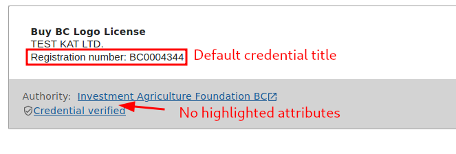
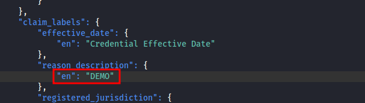

### Changes to Aries VCR issuer schema

The Aries VCR application is undergoing changes to enhance user experience on applications such as Orgbook. The primary change to the Aries VCR application is in the way that credential schemas are issued.  
  
Included below are a list of optional changes to credential schemas that issuers may be interested in making. For the purpose of clearly displaying how these changes are being used, we've provided examples of the credential changes in the new Orgbook site. You can find the code for the new Orgbook frontend [here](https://github.com/bcgov/orgbook-bc-client-vue).

#### Credential title
The credential title is the main attribute you want users to see when viewing a credential. An example of this would be the business number of a business number credential. See figure 1 for an example.

  
*Figure 1: Schema label and credential title*
  
#### Highlighted attributes
Highlighted attributes are secondary credential attributes that you believe would be important to a user viewing a specific credential. An example of this would be a Cannabis marketing license credential. A user would likely be interested in knowing the effective and expiry date of the credential, but probably would not care much about the issue date since it does not have anything to do with the validity of the credential. Aries VCR allows issuers to include only relevant credential attributes in their credential displays. See figure 2 for an example.  

  
*Figure 2: Highlighted attributes*

#### Schema labels
Aries VCR has added the functionality to specify the name of a credential schema in a multilingual format. These schema names appear as the title of the credential and let users know what type of credential they are viewing. This schema label is optional and is only needed if you plan on supporting multi language use. If no schema label is defined, a good fallback is to use the credential type description displayed in the same way as a schema label. The new version of Orgbook takes this approach. See figure 1 for example of a schema label in Orgbook.
  
#### Aries VCR defaults
##### Credential title:
If the credential title is not specified in a credential schema, or there is no claim label to match the credential title, then applications such as Orgbook may instead use the registration number of the entity holding the credential. See figure 3 for an example  
  
*Figure 3: default credential title and highlighted attributes*
  
##### Highlighted attributes:
If no highlighted attributes are specified, or there are no claim labels to match the highlighted attributes, then applications like Orgbook will not display any highlighted attributes. See figure 3.1 to see how a credential with no highlighted attributes or credential title is displayed.  
  
*Figure 3.1: Default credential title and highlighted attributes*

#### Recommended changes to schema
To incorporate these optional changes, Aries VCR recommends reviewing the new schema attributes and how to add them to your credential schema in the section below. The following example JSON snippet is from the `issuer_registration.credential_types[item]` section of the registration.registries.ca schema

~~~
{
  "claim_descriptions": {
    "effective_date": {
      "en": "Date Credential is effective"
    },
    "entity_name": {
      "en": "The legal name of entity"
    },

    ...

    "registration_renewal_effective": {
      "en": "Date the registration renewal became effective"
    }
  },
  "claim_labels": {
    "effective_date": {
      "en": "Credential Effective Date"
    },
    "entity_name": {
      "en": "Name"
    },
    
    ...

    },
    "registration_renewal_effective": {
      "en": "Registration Renewal Effective"
    }
  },
  "credential": {
    "effective_date": {
      "from": "claim",
      "input": "effective_date"
    },
    "inactive": {
      "from": "claim",
      "input": "entity_status",
      "processor": [
        "bcgov.entity_status.is_historical"
      ]
    },
    "revoked_date": {
      "from": "claim",
      "input": "expiry_date"
    }
  },
  "credential_def_id": "6qnvgJtqwK44D8LFYnV5Yf:3:CL:10:default",
  "endpoint": "/bcreg/incorporation",
  "endpoints": {
    "en": "/bcreg/incorporation"
  },
  "labels": {
    "en": "registration.registries.ca"
  },
  "logo_b64": null,
  "mapping": [
    {
      "fields": {
        "text": {
          "from": "claim",
          "input": "entity_name"
        },
        "type": {
          "from": "value",
          "input": "entity_name"
        }
      },
      "model": "name"
    },

    ...

  ],
  "name": "registration.registries.ca",
  "schema": "registration.registries.ca",
  "topic": [
    {
      "labels": {
        "en": "Registration"
      },
      "source_id": {
        "from": "claim",
        "input": "registration_id"
      },
      "type": {
        "from": "value",
        "input": "registration.registries.ca"
      }
    }
  ],
  "version": "1.0.42"
}
~~~
*Figure 4: Example registration schema*

##### Setting the schema label:
In order to set the schema label add the following JSON object to `issuer_registration.credential_types[item]`
~~~
"labels": {
	"en": "<YOUR SCHEMA NAME, Example: Registration >"
}
~~~

##### Setting the credential title and highlighted attributes:
To set the credential title and highlighted attributes setup Aries VCR issuer controller and add the following YAML object to `issuers.myorg.credential_types[index]` in `services.yaml`. Figure 4.1 shows where to insert the yaml object into the services file. Make sure to do this for each 

  
*Figure 4.1: Example insertion point*

~~~
highlighted_attributes:
- "<YOUR HIGHLIGHTED ATTRIBUTE KEY 1>"
- "<YOUR HIGHLIGHTED ATTRIBUTE KEY 2>"
credential_title:"<YOUR CREDENTIAL TITLE KEY>",
~~~
highlighted attribute keys and the credential title key refer to the attribute names on each of the attributes in the schema. An example is shown in figure 4.2. Highlighted attributes will appear on credential cards in the order they're listed on the schema. Example: attribute #1 will appear above attribute #2 on this credential card.

  
*Figure 4.2: Example attribute key*

##### Setting the credential title and highlighted attribute labels:
Attribute labels appear to the left of an attribute value on a credential card. The attribute label describes the attribute value being displayed on the credential card. See figure 4.3 for an example.

  
*Figure 4.3: Attribute label and value*

To set the attribute label simply edit the claim label for the attribute in question. To do so in your credential schema, go to `issuer_registration.claim_labels.<YOUR ATTRIBUTE KEY>.[locale]` change the field to your desired label as seen in figure 4.4 where we change the `reason_description` from `Reason` to `DEMO`. See figure 4.5 for the resulting change in Orgbook

  
*Figure 4.4: Change from reason to demo*

  
*Figure 4.5: resulting change in Orgbook*

